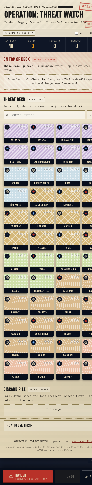
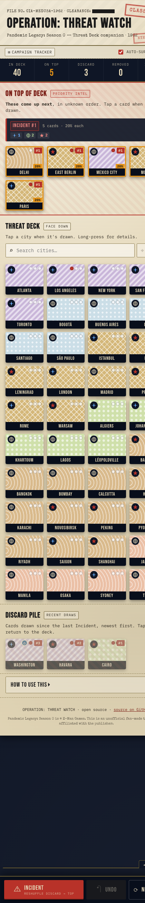
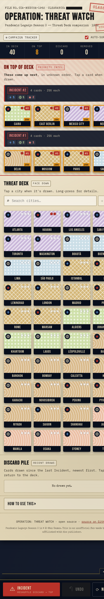
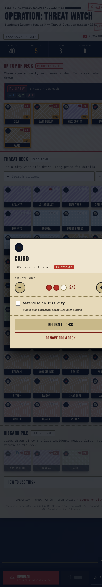
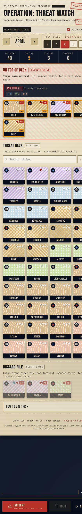
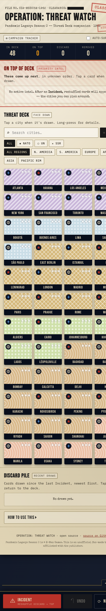
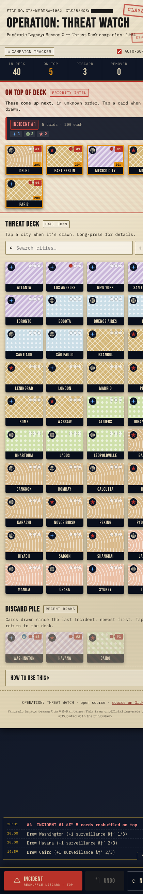
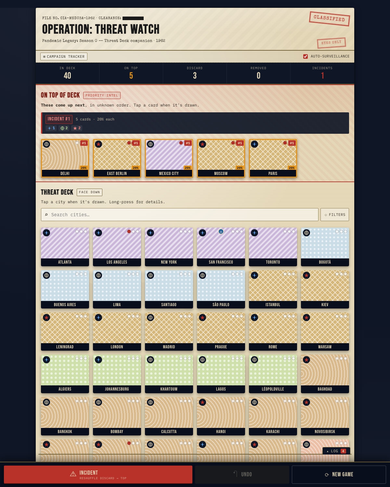

# Operation: Threat Watch

> **A mobile-first companion web app for _Pandemic Legacy: Season 0_.**
> Track the Threat Deck across a session — see which cities have been drawn, what's in the discard, and what's about to come up again after each Incident. Cold-War declassified-dossier aesthetic.

🔗 **Live app:** [michaellomuscio.github.io/pandemic-s0-threat-watch](https://michaellomuscio.github.io/pandemic-s0-threat-watch/)
📦 **Source:** [github.com/michaellomuscio/pandemic-s0-threat-watch](https://github.com/michaellomuscio/pandemic-s0-threat-watch)
📱 **Installable** on iOS / Android via "Add to Home Screen" — works offline.

<p align="center">
  
</p>

---

## Why this exists

In _Pandemic Legacy: Season 0_, the **Threat Deck** is the deck you draw from at the end of each turn to place Soviet surveillance on cities. When an **Incident** triggers in-game, the entire discard pile is shuffled and placed **back on top of the deck** — meaning the cities you've already seen this round are the next ones coming up.

Knowing which cities are in that "on top" pile is a huge strategic advantage. But the board state is already overloaded with cubes, tokens, protocol cards, and player-board chrome; flipping through a paper discard pile mid-turn slows everything down and breaks the table flow.

This app keeps the deck state on your phone, with one big red button labelled **INCIDENT**.

---

## Quickstart

1. Open [the live app](https://michaellomuscio.github.io/pandemic-s0-threat-watch/) on your phone.
2. **Tap a city** every time a Threat Card is drawn → it moves to the Discard pile.
3. **Press ⚠ INCIDENT** when one triggers → the discard reshuffles back onto the "On Top of Deck" zone.
4. **Tap On-Top cards** as they come up — these are the only cards that can be drawn until the pile is empty.
5. **Long-press** any card for the inspector (surveillance ±, safehouse toggle, remove from deck).

State persists in your browser's `localStorage`. A refresh, an accidental tab close, or a phone restart won't lose your tracker.

---

## Features

### The basics (default view, kept deliberately simple)

<p align="center">
  
</p>

- All **48 base-game cities** styled to match the actual board art — region pattern, faction icon (◆ NATO · ◯ UN · ★ SSR), city label.
- Three live zones: **On Top of Deck**, **Threat Deck**, **Discard**. Plus a **Removed from Play** zone that auto-hides when empty.
- The bottom action bar always has three buttons: **⚠ Incident**, **Undo**, **New Game**.
- Search bar above the deck. Filters and the campaign tracker are hidden by default — toggle them in if you want them.

---

### Mid-game flow

<p align="center">
  
</p>

After a few draws and one Incident, the app might look like this:

- **5 cards** are on top of the deck (the "Priority Intel" zone, highlighted red). Each card has a **probability badge** (`20%` when there are 5 cards in the stratum).
- The **status strip** at the top tracks how many cards are in each zone plus the running Incident count.
- **Surveillance dots** fill in red as cities accumulate surveillance tokens (visible on Los Angeles, Mexico City, Moscow, etc.).
- **Safehouse markers** appear on cities that have one (San Francisco shows the safehouse `⌂` icon).
- The **Discard pile** below shows the most recent draws (newest first, with a draw-order badge).

---

### Stratified Incidents

<p align="center">
  
</p>

Multiple Incidents stack. The newest reshuffle comes up **before** older "on top" cards, so the app shows them as separate strata:

- **INCIDENT #2** (top): 4 cards, 25% chance each. These come up first.
- **INCIDENT #1** (below): 4 cards, 25% chance each. These come up after #2 is exhausted.
- Every card carries an Incident badge (`#1`, `#2`, `#3`…) so you can always tell which stratum it belongs to.

When a stratum has 4+ cards, a small faction summary (NATO/UN/SSR breakdown) renders inside the banner so you can plan defenses without counting tiles.

---

### Inspector modal

<p align="center">
  
</p>

**Long-press any card** to open the inspector. From there you can:

- See the city's **faction, region, current zone** at a glance
- Adjust **surveillance ±** with large tap-targets (0/1/2/3 dots)
- Toggle the **safehouse** on/off (safehoused cities skip the auto-surveillance increment when drawing)
- **Mark drawn / Return to deck / Remove from deck** with explicit action buttons

The modal background dims and the city's region pattern frames the top so you always know which card you're editing.

---

### Campaign tracker (opt-in HUD)

<p align="center">
  
</p>

Tap the **⊞ Campaign tracker** toggle at the top to reveal:

- **Current month**: Prologue → January → … → December. `◂` and `▸` step through.
- **Threat level**: 1–6 with the official draw rate of **2 / 2 / 2 / 3 / 3 / 4** cards per turn. Tap a pip to jump to that level. Past levels show dark; the current level is highlighted red with a glow.

Hidden by default because most groups don't need it on screen — it's reference, not the working surface.

---

### Filters & search

<p align="center">
  
</p>

The search bar is always visible. Tap **⌖ Filters** to reveal:

- **Faction filter**: ALL · NATO · UN · SSR
- **Region filter**: ALL REGIONS · N. AMERICA · S. AMERICA · EUROPE · AFRICA · ASIA · PACIFIC RIM

Useful when there are 30+ cards left in the deck and you need to find _Léopoldville_ fast.

---

### Action log

<p align="center">
  
</p>

The bottom-right log chip (`Log ⓲`) opens a collapsible history panel. Every action you've taken this session, with timestamps, color-coded by type:

- 🔴 **Incidents** (red)
- ⚪ **Draws** (paper)
- 🟢 **Returns to deck** (green)
- 🟠 **Surveillance changes** (amber)
- 🔵 **Safehouse toggles** (blue)
- 🌟 **Threat level / month changes** (gold)

Useful for sanity-checking what happened earlier in the turn ("did we already draw Cairo? yes, 4 minutes ago").

---

### Installable PWA

The app ships with a [Web App Manifest](manifest.webmanifest) and a [service worker](sw.js). Once you've opened it once, it works fully offline. "Add to Home Screen" gives you a proper installed app with its own icon — no browser chrome, no fiddling.

- App icon: red Soviet star inside a Cold-War frame on a navy briefing-room background.
- Theme color: navy `#0F1626`.
- Cache strategy: cache-first for the app shell, stale-while-revalidate for Google Fonts.
- Cache version: `CACHE_VERSION` in `sw.js`. Bump it when releasing static changes.

---

### Keyboard shortcuts

For groups playing with the tracker open on a laptop or tablet:

| Key | Action |
| --- | --- |
| `I` | Trigger Incident |
| `Z` | Undo last action |
| `Esc` | Close inspector modal |

---

## How it looks on desktop

<p align="center">
  
</p>

Cards reflow into a wider grid up to a max width of ~980px. The mobile-first design holds up — the desktop view is the same app, just with more room to breathe.

---

## Design notes

The aesthetic is **Cold-War declassified dossier**, pitched at 1962.

- **Background**: navy `#0F1626` briefing-room with a subtle world-map watermark.
- **Body surface**: manila `#E6D9B9` folder with diagonal weave.
- **Red ink stamps**: "CLASSIFIED", "EYES ONLY", "INCIDENT" — typewriter font, slightly off-register.
- **Typography**:
  - `Bebas Neue` — display headers, status numbers, card labels (geometric impact)
  - `Special Elite` — typewriter accents, stamps, hints (mechanical texture)
  - `IBM Plex Mono` — body text, controls (clean monospaced)
- **Faction inks**: NATO blue, UN olive-green, SSR blood red — taken from the actual board.
- **Region tile patterns**: lavender stripes (N.A.), powder blue dots (S.A.), gold harlequin (Europe), olive dots (Africa), tan waves (Asia), salmon waves (Pacific Rim). These mirror the printed board.

The **Incident** button at the bottom triggers a full-screen red-stamp slam animation when pressed, plus a vibration on supported mobile devices. Because it deserves the drama.

---

## Pandemic Legacy: Season 0 — board reference

The base set is **48 cities**, broken down by faction (14/20/14) and region (8/5/11/6/13/5):

| Region | NATO/Allied (◆) | UN/Neutral (◯) | SSR/Soviet (★) |
| --- | --- | --- | --- |
| **North America** (8) | San Francisco · Los Angeles · Toronto · New York · Washington · Atlanta | Mexico City | Havana |
| **South America** (5) | | Bogotá · Lima · São Paulo · Santiago · Buenos Aires | |
| **Europe** (11) | London · Paris · Rome · Istanbul | Madrid | East Berlin · Warsaw · Prague · Leningrad · Moscow · Kiev |
| **Africa** (6) | Algiers · Johannesburg | Lagos · Khartoum · Léopoldville | Cairo |
| **Asia** (13) | Saigon | Riyadh · Karachi · Delhi · Bombay · Calcutta · Bangkok | Baghdad · Novosibirsk · Peking · Pyongyang · Shanghai · Hanoi |
| **Pacific Rim** (5) | Sydney | Tokyo · Osaka · Manila · Jakarta | |
| **Total: 48** | **14** | **20** | **14** |

The faction affiliations reflect 1962 geopolitics — Cuba is the only Soviet city in the Americas, Turkey/Istanbul is Allied (NATO since 1952), Spain/Madrid is Neutral (joined NATO in 1982), Saigon is Allied (South Vietnam, US-aligned), Tokyo and Osaka are Neutral (postwar Japan), etc.

---

## Tech

- **Vanilla HTML / CSS / JS.** No framework. No build step. No dependencies. No tracking.
- ~1,500 lines of source across three files: [`index.html`](index.html), [`style.css`](style.css), [`app.js`](app.js).
- Plus the PWA bits: [`manifest.webmanifest`](manifest.webmanifest), [`sw.js`](sw.js), [`icon-192.png`](icon-192.png), [`icon-512.png`](icon-512.png), [`icon-maskable.png`](icon-maskable.png).
- Served via **GitHub Pages** from the `main` branch root.
- State persisted in `localStorage` under the key `threat-watch.v2`. Schema migration from v1 is automatic.

### Local development

```bash
git clone https://github.com/michaellomuscio/pandemic-s0-threat-watch.git
cd pandemic-s0-threat-watch
# Open index.html directly, or serve locally:
python3 -m http.server 8080
# → http://localhost:8080
```

### Demo / screenshot mode

The app honors a `?demo=` URL parameter to programmatically open panels — used to generate the README screenshots. Comma-separated tokens:

- `hud` — opens the campaign HUD
- `filters` — opens the filter bars
- `log` — opens the action log
- `inspector:<city-id>` — opens the inspector modal on a specific city (e.g. `inspector:cairo`)

Example: `https://…/?demo=hud,filters,inspector:moscow`

---

## Caveats

- This is an **unofficial fan tool**. _Pandemic Legacy: Season 0_ is © Z-Man Games / Asmodee. No proprietary art, copy, or game logic is included here — only the city names and faction/region affiliations that anyone can read off the board.
- The base set is the 48 cities printed on the board. _Pandemic Legacy_ campaigns add and remove cards as you play; use long-press → Remove to take a card out of the deck, or just ignore cities you've never added.
- One shared state per browser. If two phones are tracking, they're independent. Designate one phone as the source of truth at the table.
- The probability badge is the trivial `1/N` for the current stratum. The app doesn't try to model the cards still in the unseen main deck — that's a memory exercise the players still own.

---

## Roadmap (maybe-someday)

- Multiple save slots (separate per campaign group)
- Add custom cards mid-campaign (some legacy events introduce new Threat Cards)
- Cross-device state sync (a small Cloudflare Worker would do it)
- Threat level / draw rate auto-applied (currently a visual reference only)
- Sound effects on Incident button (off by default)

No commitments. PRs welcome if you play S0 and want a feature.

---

## License

[MIT](LICENSE) — copy, modify, fork, port it to another Pandemic season. The world map watermark and faction icons are original SVG.

---

<p align="center"><i>Pandemic Legacy: Season 0 — 1962 — Operation: Threat Watch</i></p>
